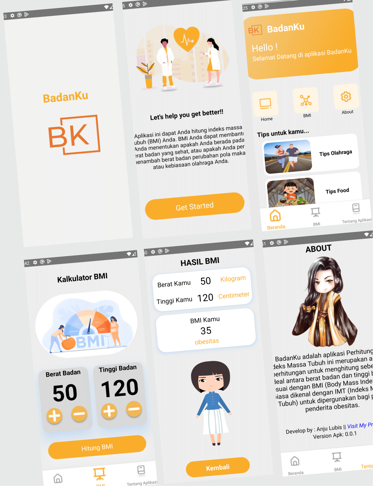

# React_Native-BadanKu-AppMobile

BadanKu is a Body Mass Index Calculation application calculation application to calculate how ideal between weights body and height according to BMI (Body Mass Index) or commonly known as BMI (Body Mass Index) to be used for obese people.


>**Note**: This application was built and developed by [Anju Lubis](https://anjulubis.vercel.app/). This application was built starting from August 2023 and in September 2023 this application has met the MVP (Minimum Viable Product) value and is suitable for use and published with version 0.0.1

>**Note**: If you want to take this code for some purpose, please contact me, or at least give me a STAR for this project :smile: :yum:

## Screenshot Design App
>


## Prerequisites

Install node + android studio & emulator

[Install npm](https://www.npmjs.com/get-npm)

[Install android studio & emulator](https://developer.android.com/studio)


## Step 1: Start the Metro Server

First, you will need to start **Metro**, the JavaScript _bundler_ that ships _with_ React Native.

To start Metro, run the following command from the _root_ of your React Native project:

```bash
# using npm
npm start

# OR using Yarn
yarn start
```

## Step 2: Start Application

Let Metro Bundler run in its _own_ terminal. Open a _new_ terminal from the _root_ of  project. Run the following command to start your _Android_ or _iOS_ app:

### For Android

```bash
# using npm
npm run android

# OR using Yarn
yarn android
```

### For iOS

```bash
# using npm
npm run ios

# OR using Yarn
yarn ios
```

If everything is set up _correctly_, you should see app running in your _Android Emulator_ or _iOS Simulator_ shortly provided you have set up emulator/simulator correctly.

This is one way to run your app — you can also run it directly from within Android Studio and Xcode respectively.


## Congratulations! :tada:

You've successfully run and used app


# Anju Profile
To be able to contact me, I put my contact

- [Anju Lubis portfolio](https://anjulubis.vercel.app/) 
- [LinkedIn](https://www.linkedin.com/in/anju-ucok-lubis/) 
- [Mail](anjuucoklubis@gmail.com) 
